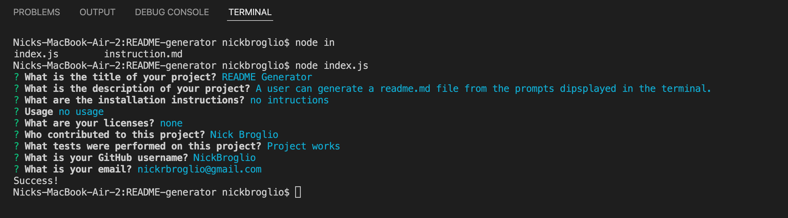

# README Generator

  

  ## Description
  A user can generate a readme.md file from the prompts dipsplayed in the terminal.

  
  
  ## Table Of Contents
  * [Installation](#installation)
  * [Usage](#usage)
  
  * [Contributing](#contributing)
  * [Tests](#tests)
  * [Questions](#questions)
  
  ## Installation
  no intructions
  
  ## Usage
  
  
  
  
  
  ## Contributing
  Nick Broglio
  
  ## Tests
  Project works
  
  ## Questions 
  If you have any questions, contact me at:
  
  * Github: NickBroglio
  * Email: nickrbroglio@gmail.com
  